# 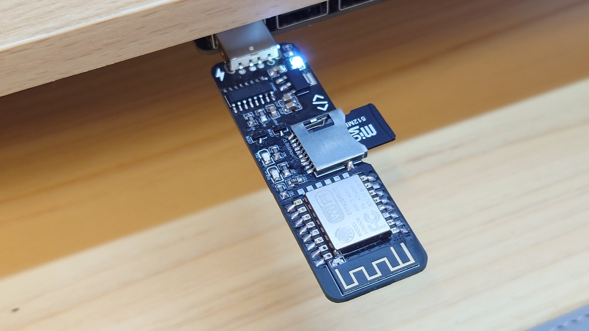

# WebStick

A miniature personal cloud drive designed for ESP8266 (ESP12F)

The WebStick is a ESP8266 powered device that provide a basic miniature cloud drive functions using WiFi in your home network. With proper setup for reverse proxy, caching server and domain name pointing to your home IP address, you can access your Webstick from the internet to provide a really basic file storage and share services.

**The WebStick is not a NAS, although it provide similar feature to a NAS, it is not designed to safely store any files for a prolong period of time. Always remember to backup your files on your WebStick.**

## Features

*Features with the (v3) tag means the feature is designed for WebStick v3 and might not work as expected on WebStick v2*

- Basic Web Server

- Directory View 

- Cookie based login system
  - Multi-users support *(v3)*

  - Add / Remove non admin users *(v3)*

- File Manager

  - File Upload / Download (with multiple-file zip download support)

  - File Open, Cut and Copy

  - Support UTF-8 filename (32 bit length only, filename length depends on variable bytes used per char)

  - File Share with QR code *(v3)*

- File Searching Tool

  - Filename / File extension search

- System Information

  - SD storage info
  - WiFi info
  - Sending Wake-on-LAN magic packet *(v3)*

- WebApps

  - Music Player
  - Photo Viewier
  - Video Player
  - Markdown Editor
  - Notepad (Modified version of ACE Editor)

## Usage

### Hosting

1. Format your micro SD card as FAT (Recommend using [SD Card Formatter](https://www.sdcard.org/downloads/formatter/)). By default 512MB is more than enough but it can support up to 4GB micro SD cards. 
2. Download and put everything under sd_card folder in this repo into your micro SD card
3. Edit the files under /cfg/ to setup WiFi credentials (wifi.txt), management passwords (admin.txt) and optionally mDNS domain name (mdns.txt)
4. Insert your SD card into the WebStick SD card slot
5. Power on your WebStick by inserting it into your computer USB port (for debug / flash mode) or phone charger with USB A port.
6. Access your WebStick using the device IP address (http://192.168.0.100/, faster) or mDNS name (e.g. http://webstick.local, slower)

#### Using your domain with WebStick

mDNS are local only domain names. If you want your viewer to be able to access your website from the public internet via your domain or your home public ip address, you will need to purchase a domain name, setup your DNS and / or your NAT router's port forward rules. 

#### Debugging

If the WebSticks encounter errors, you can easily debug it by observing the green LED under the SD card slot.

- Blinking every 1 second: Unable to connect to WiFi
- Blinking every 3 seconds: SD card initialization / read failed

For advance debug output, you can insert the WebStick to your computer, open Arduino IDE and select the COM port of the WebStick. Connect with Serial Monitor at baudrate 9600 (v2) or 115200 (v3) to see detail debug information.

### Build from Source

The following libraries are required for building the WebStick backend code (firmware to be used in ESP8266) using Arduino IDE. You can find the source code for the backend bare metal web-server in the ```/firmware``` folder.

#### Board Settings

Here are the recommended settings for best performance.

- Board: Wemos D1 R2 & Mini

  * CPU clockspeed: 160Mhz

  * IwIP Varient: v2 Higher Bandwidth

#### Require external library:

* ESPAsyncTCP (https://github.com/me-no-dev/ESPAsyncTCP)
* ESPAsyncWebServer (https://github.com/me-no-dev/ESPAsyncWebServer)
* ArduinoJson (https://github.com/bblanchon/ArduinoJson)
* Wake On LAN (https://github.com/a7md0/WakeOnLan)

## Screenshots

#### Basic Web Servers

The WebStick provide basic web server functions like a fresh install Apache


▲ Homepage template (you can modify it to whatever you want)

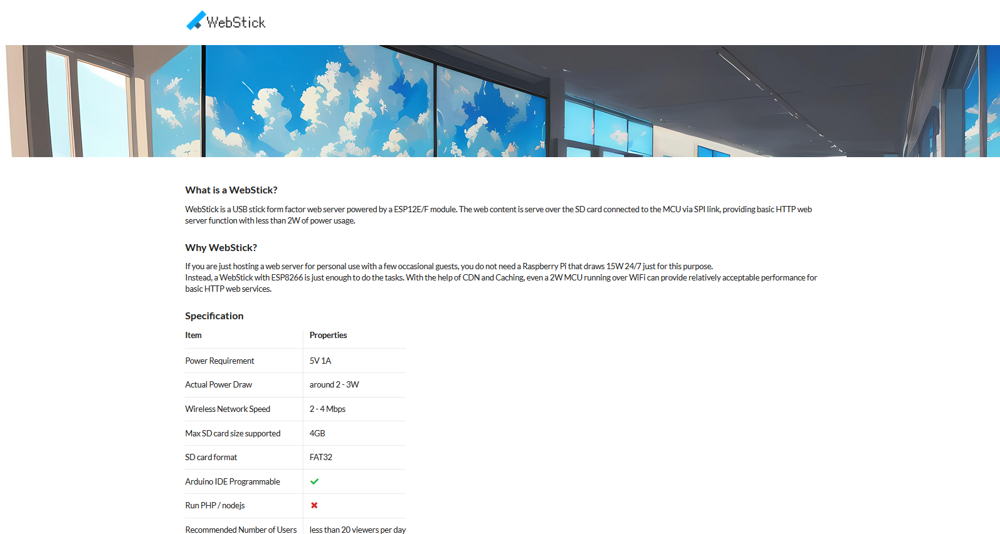

▲ Web server for HTML files

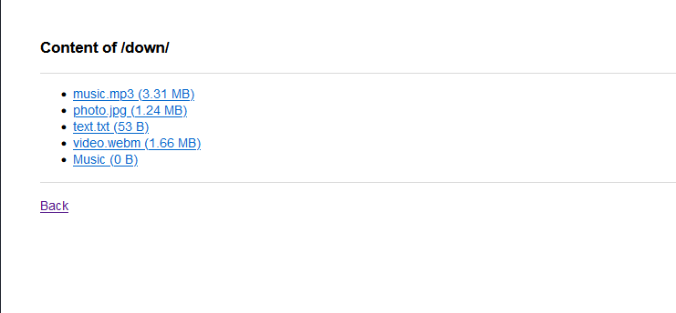

▲ Directory listing

#### Admin / Management Functions

WebStick contains basic functions for single admin multi users environment. All file operations can only be performed by registered users in this system.

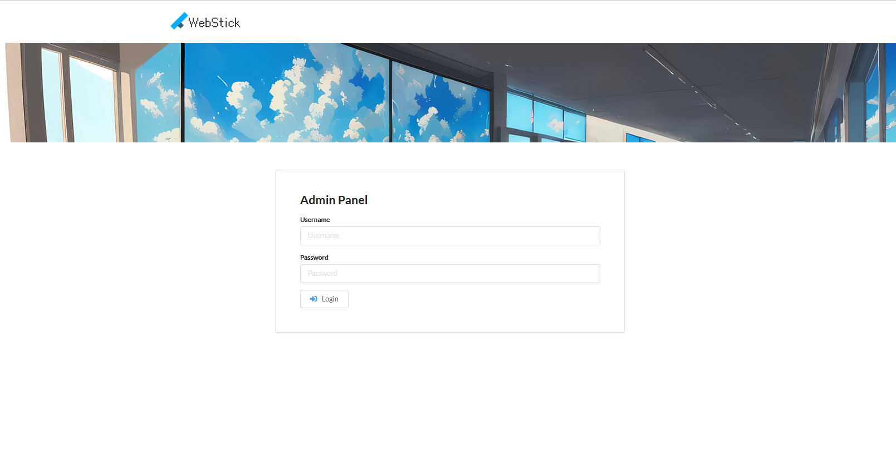

▲ Login / User System (based on Cookie not Basic Auth)

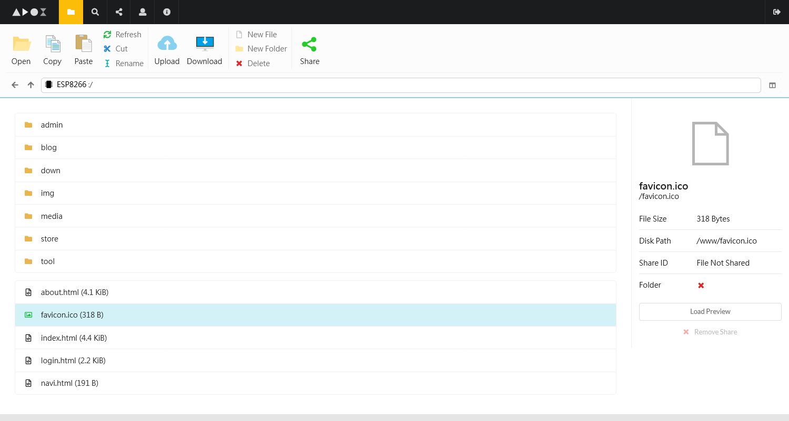

▲File Manager (Support upload, (multi-zip) download, copy, cut, paste, rename and new folder / files)

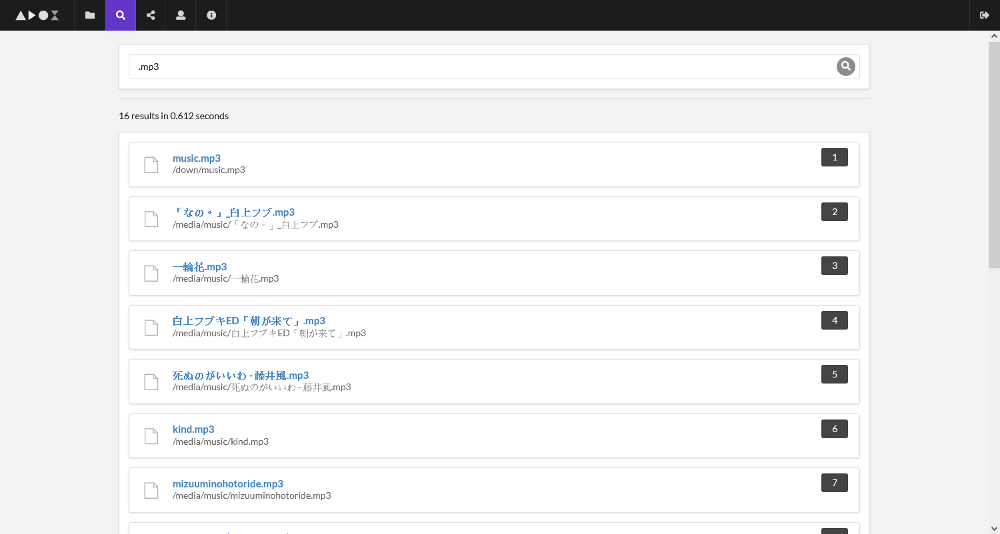

▲ Basic Search Engine (for local files)

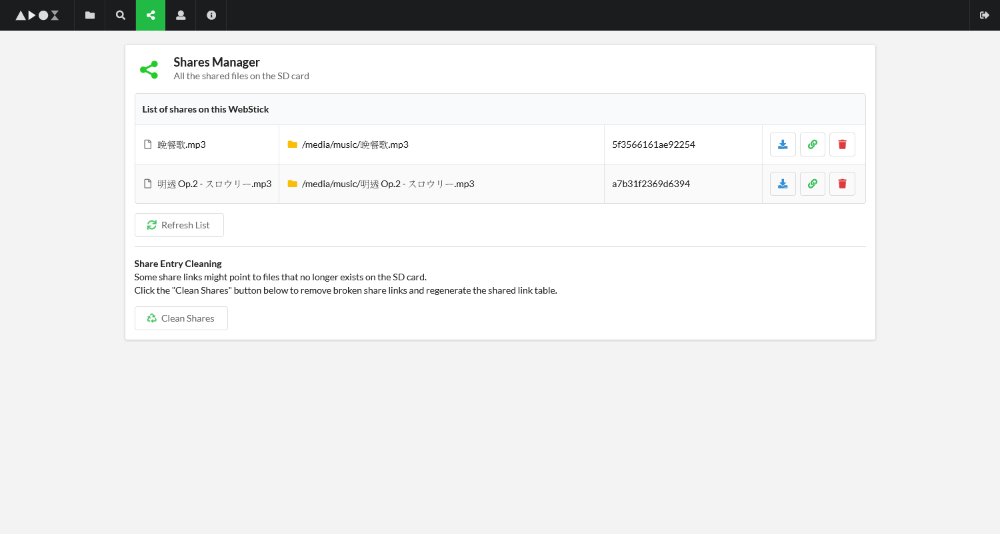

▲ Share Manager

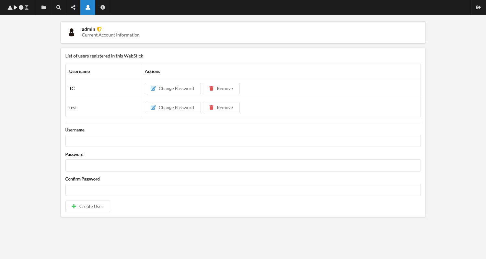

▲ User Manager (only admin can create / remove users)

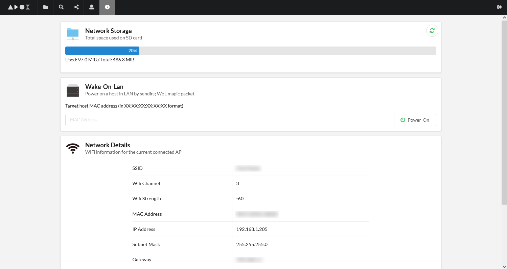

▲ System Statistics & Wake-On-LAN utilities

#### Multimedia

There are also limited multimedia streaming functionality on the WebStick.

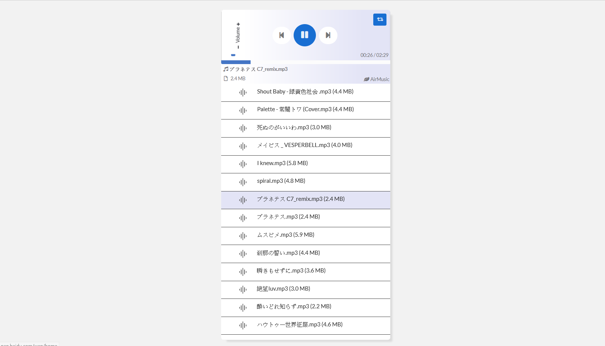

▲ Basic Music Player

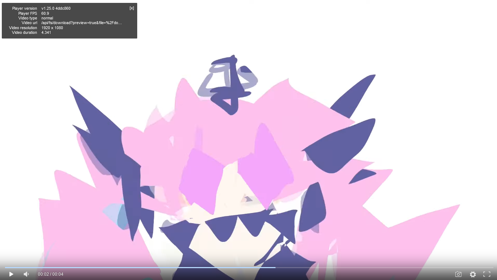

▲ Video Player (really small webm / mp4 files only)

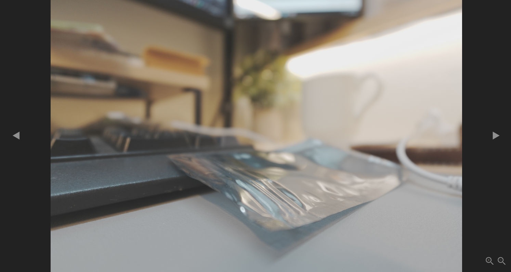

▲ Photo Viewer

#### Other Utilities

WebStick also got other text editing utilities. If you are using markdown as notes or you want to update your website remotely, you can use the markdown editor or the notepadA editor. 


▲ Markdown Editor (Powered by SimpleMDE project)

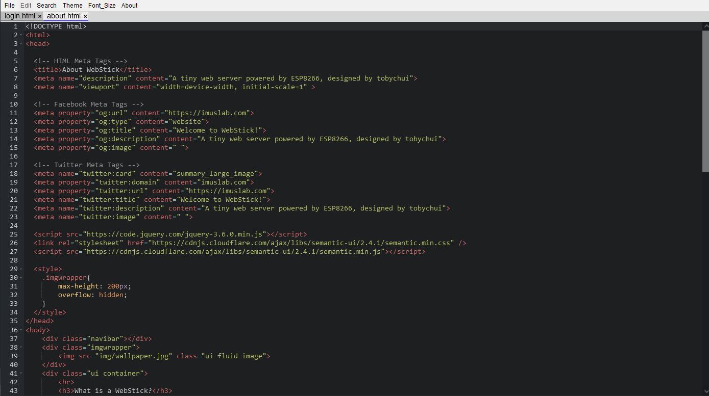

▲ NotepadA Code Editor (Powered by ace editor, support multi-tabs)

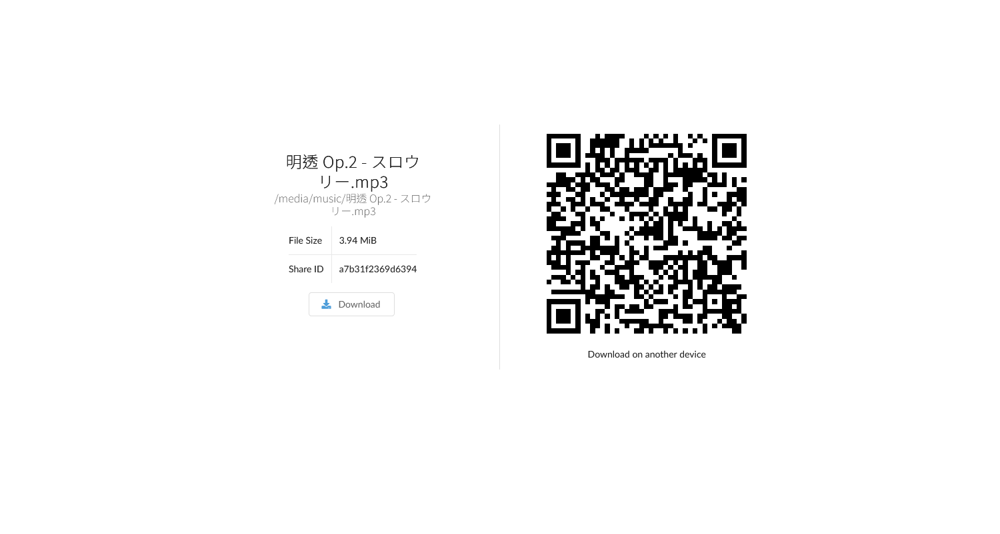

▲ File Sharing Interface

## Limitations

As you might have notice by now this system is hosted on a 2 USD MCU (ESP8266), even if web server is written in bare metal, it still have the following limitations

- Filename length (hardcoded to 32 bits per filename, might be shorter for UTF-8 as it use variable byte structure, but technically this is not the system limit)

- File size limit (recommend) <= 5MB, any file size larger than 5MB that is not stream-able (e.g. mp4) is not meaningful. Stream-able files can be larger than this size (e.g. webm) with acceptable playback speed.

- Slow Upload / Download speed (2 - 4Mbps), Very slow concurrent R/W speed (200 - 210 Kbps)

- Single admin session (cookie), but more users can be created in WebStick v3

## Getting the Hardware

All the gerber files are stored under the `/pcb` folder. It should be ready to manufacture. For part list, see BOM list csv file. If you want to make one for yourself, you can place order at PCB printing service provider or get one from my [Tindie Store](https://www.tindie.com/products/tobychui/instant-webstick-a-usb-stick-web-server/)

#### Notes on Issues & Feature Requests

As this is one of my side projects that I only do it for fun, **feature requests will not be accepted unless I am also interested in such feature.** Though, PR are always welcomed but make sure your PR is compatible with the latest hardware design. PRs in firmware that involve / require hardware changes will not be accepted.

## License

Hardware Design (PCB files): CC BY-NC-SA

Backend Code (Arduino): GPLv3

Front-end Code (html files): GPLv3
